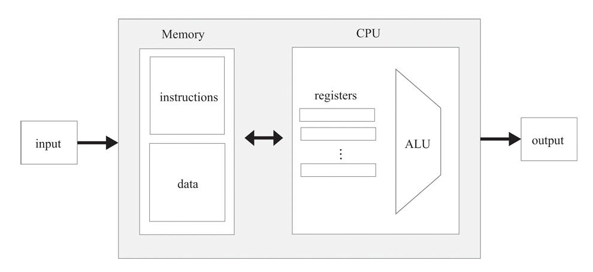
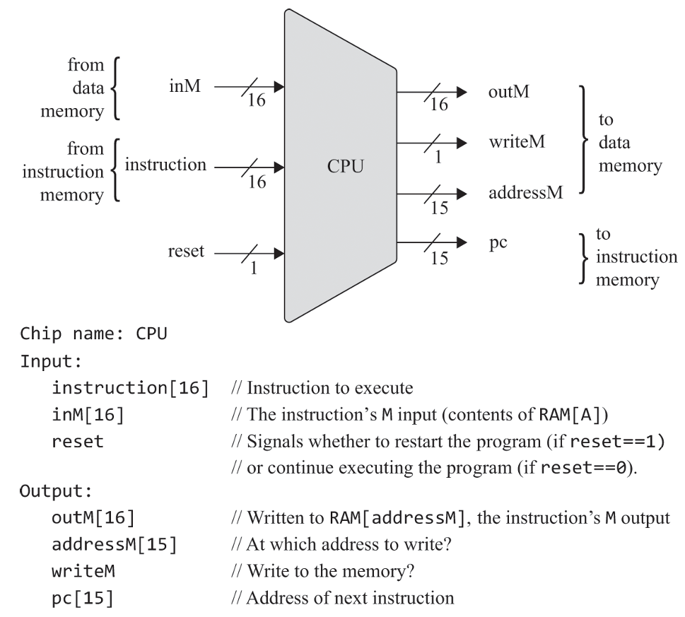

# Computer Architecture

This project explains the basic architecture of a computer, including **Memory**, **CPU**, and **Input/Output (I/O)**. These three components work together to execute every program.

---

## Computer Architecture

<p align="center">
  
</p>

The architecture consists of three major components:

- **Memory** – Stores data and program instructions.
- **CPU** – Processes instructions and performs computations.
- **Input/Output (I/O)** – Allows the computer to communicate with external devices.

---

# Memory

Memory stores everything the CPU needs to execute a program, including both **instructions** and **data**.

---

## Physical View of Memory

Physically, memory is a long sequence of fixed-size storage locations called **memory registers**.

Each register has:

- A **unique address**
- A **stored value**

```
Address      Value
-------      -----
0            ...
1            ...
2            ...
3            ...
...
```

The CPU accesses any register by providing its **address**.

This process is called **addressing**.

---

## Random Access Memory (RAM)

RAM allows the CPU to access **any memory location in the same amount of time**, regardless of where it is stored.

For example:

- Accessing address **5**
- Accessing address **50,000**

Both take approximately the same time.

---

## Logical View of Memory

Although memory is physically one continuous block, logically it is divided into two parts:

```
Memory
│
├── Data Memory
│
└── Instruction Memory
```

---

## Data Memory

Data memory stores the program's data such as:

- Variables
- Arrays
- Objects

Example:

```cpp
int x = 10;
```

After compilation:

```
Address     Value
100         10
```

The variable `x` is simply the value stored at address **100**.

### Reading Data

```
Address → Memory → Value
```

Example:

```
Address = 100

Value = 10
```

### Writing Data

Writing replaces the old value with a new one.

Before:

```
Address    Value
100        10
```

After:

```
Address    Value
100        25
```

---

## Instruction Memory

High-level programs are first compiled into **machine code**.

Before execution:

```
Source Code
      │
      ▼
Compiler
      │
      ▼
Machine Code (Executable)
      │
      ▼
Instruction Memory
      │
      ▼
CPU Executes Instructions
```

The CPU continuously fetches instructions from instruction memory.

---

## Data Memory vs Instruction Memory

| Data Memory | Instruction Memory |
|-------------|--------------------|
| Stores program data | Stores program instructions |
| Contains variables, arrays, objects | Contains machine instructions |
| Can change during execution | Usually remains unchanged while running |

---

# CPU (Central Processing Unit)

<p align="center">
  
</p>

The **CPU** is the brain of the computer.

It executes instructions by:

- Performing calculations
- Accessing memory
- Controlling the execution of programs

---

## Main Components

### 1. Arithmetic Logic Unit (ALU)

The **ALU** performs arithmetic and logical operations.

Examples:

- Addition
- Subtraction
- Bitwise AND / OR
- Comparisons

---

### 2. Registers

Registers are **small, high-speed memory locations** inside the CPU.

| Register | Purpose |
|----------|---------|
| Data Register | Stores temporary values |
| Address Register | Stores memory addresses |
| Program Counter (PC) | Stores the next instruction address |
| Instruction Register (IR) | Stores the current instruction |

---

### 3. Control Unit

The **Control Unit** controls the execution of instructions.

It:

- Fetches instructions
- Decodes instructions
- Sends control signals
- Coordinates the ALU, registers, and memory

---

## Fetch-Decode-Execute Cycle

Every program runs by repeating these three steps.

```
Fetch
   ↓
Decode
   ↓
Execute
   ↓
Repeat
```

### Fetch

The CPU fetches the next instruction from instruction memory.

### Decode

The Control Unit determines what the instruction means.

### Execute

The ALU, registers, and memory perform the required operation.

The Program Counter is then updated to the next instruction.

---

# Input and Output (I/O)

I/O devices allow the computer to communicate with the outside world.

### Examples

- Keyboard
- Mouse
- Monitor
- Printer
- Speaker
- Microphone
- Storage Devices
- Network Card

---

## Memory-Mapped I/O

Instead of treating devices differently, the computer assigns each device a **special memory region** called a **memory map**.

The CPU communicates with devices by simply reading from or writing to these memory locations.

```
CPU
 │
 ▼
Memory
 ├── Data Memory
 ├── Instruction Memory
 └── I/O Memory (Memory Map)
```

---

## Keyboard Example

When a key is pressed:

```
Press Key
     │
     ▼
Keyboard Memory Map
     │
     ▼
CPU Reads the Value
```

The keyboard writes the pressed key's binary code into its memory map.

---

## Screen Example

When the CPU writes data to the screen's memory map:

```
CPU Writes Data
       │
       ▼
Screen Memory Map
       │
       ▼
Pixels Update
```

The monitor automatically updates the corresponding pixels.

---

# Summary

| Component | Purpose |
|-----------|---------|
| **Memory** | Stores data and program instructions |
| **CPU** | Executes instructions and performs computations |
| **ALU** | Performs arithmetic and logical operations |
| **Registers** | Store temporary data and addresses |
| **Control Unit** | Controls instruction execution |
| **Instruction Memory** | Stores machine instructions |
| **Data Memory** | Stores variables and program data |
| **Memory-Mapped I/O** | Allows the CPU to communicate with external devices through memory |

---

## Key Takeaways

- Memory stores both **data** and **program instructions**.
- The CPU executes instructions using the **Fetch → Decode → Execute** cycle.
- Registers provide fast temporary storage inside the CPU.
- The ALU performs arithmetic and logical operations.
- The Control Unit coordinates all CPU activities.
- Memory-mapped I/O allows the CPU to interact with devices like keyboards and screens by reading from and writing to memory.
````
