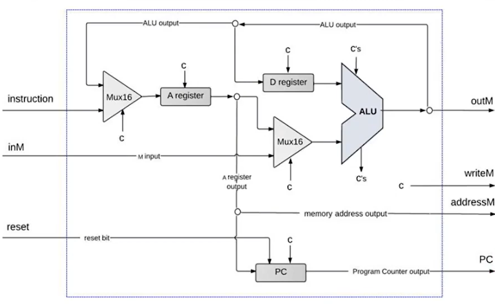
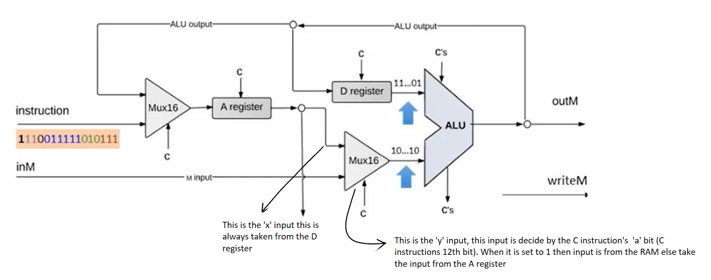
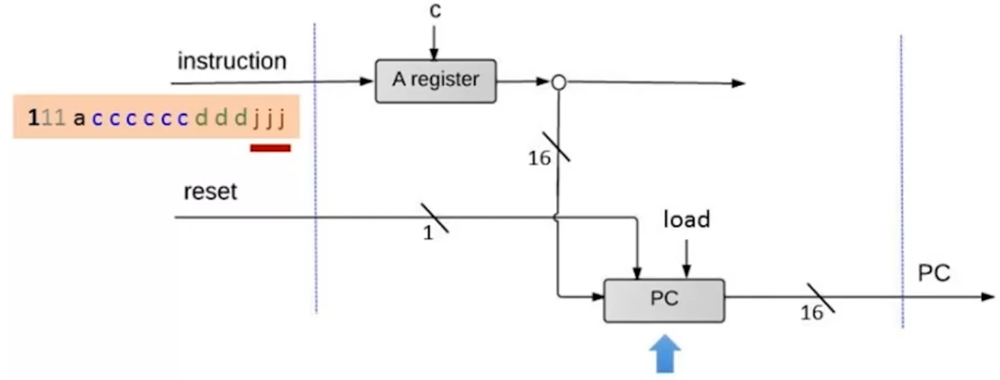

# Hack CPU Architecture Notes

<p align="center">
  
</p>

## 1. Instruction Decoding & The Divide-and-Conquer Strategy

The Hack CPU processes 16-bit instructions. The Most Significant Bit (**MSB**, `instruction[15]`) determines the instruction type:

* **A-Instruction (`MSB = 0`):** `0vvv vvvv vvvv vvvv` $\rightarrow$ Load a 15-bit constant into the A-register.
* **C-Instruction (`MSB = 1`):** `111a cccc ccdd djjj` $\rightarrow$ Perform a computation and handle storage/jumping.

```text
  15  14  13   12   11  10   9   8   7   6    5   4   3    2   1   0
┌───┬───┬───┬─────┬──────────────────────-─┬────────────┬───────────┐
│ 1 │ x │ x │  a  │ c1  c2  c3  c4  c5  c6 │ d1  d2  d3 │ j1  j2  j3│
└───┴───┴───┴─────┴──────────────────────-─┴────────────┴───────────┘
              │           │                     │            │
         ALU Y Input   ALU Control          Destination     Jump
          (A vs M)    (zx..no pins)         (A, D, M)    Conditions

```

---

## 2. Register Load & Destination Routing (`d1, d2, d3`)

The **destination bits** (`instruction[3..5]`) determine where the computed result is saved. Multiple destinations can be active **simultaneously**:

* **`d1` (`instruction[5]`):** Write to **A-register**.
* **`d2` (`instruction[4]`):** Write to **D-register**.
* **`d3` (`instruction[3]`):** Write to **Memory (`outM`)**.

### Destination Decoding Table

| Destination | Binary (`d1 d2 d3`) | Target Storage | Control Logic |
| --- | --- | --- | --- |
| **`null`** | `000` | None | Result is calculated but discarded |
| **`M`** | `001` | `RAM[A]` | `writeM = instruction[15] AND d3` |
| **`D`** | `010` | `D-register` | `loadD = instruction[15] AND d2` |
| **`MD`** | `011` | `D-register` & `RAM[A]` | Both D and Memory load signals active |
| **`A`** | `100` | `A-register` | `loadA = isA OR (isC AND d1)` |
| **`AM`** | `101` | `A-register` & `RAM[A]` | Both A and Memory load signals active |
| **`AD`** | `110` | `A-register` & `D-register` | Both A and D load signals active |
| **`AMD`** | `111` | `A`, `D`, & `RAM[A]` | All three destinations receive output |

### A-Register Dual-Input Mux

The A-register has a multiplexer in front of it because it receives input from two completely different sources:

1. **A-Instruction:** Raw 16-bit instruction constant (`@value`).
2. **C-Instruction:** The computed result output from the ALU.

$$\text{A-Input} = \text{Mux16}(\text{instruction}, \text{aluOut}, \text{sel}=\text{instruction}[15])$$

---

## 3. ALU Configuration


<p align="center">
  
</p>

* **`X` Input:** Driven exclusively by the **D-register**.
* **`Y` Input:** Toggled by the **`a`-bit** (`instruction[12]`):
* `a = 0`: Operates on the **A-register** value.
* `a = 1`: Operates on data read from memory (**`inM`** / `RAM[A]`).


* **Control Bits (`c1..c6`):** Direct 1:1 mapping to the ALU function control pins (`zx`, `nx`, `zy`, `ny`, `f`, `no`).
* **Status Flags (`zr`, `ng`):** Feed directly into the jump evaluation logic.

---

## 4. Jump & Program Counter (PC) Logic

<p align="center">
  
</p>

To perform a jump (branching), the target address is **always pre-loaded into the A-register**.

1. **Condition Flags:** `zr` ($=0$) and `ng` ($<0$) are combined to derive `greaterThanZero` ($>0$).
2. **Jump Evaluation:** The 3 jump bits (`j1, j2, j3`) check whether the ALU output satisfies any active condition:
* `j1` (`instruction[2]`): Jump if negative ($<0$)
* `j2` (`instruction[1]`): Jump if zero ($=0$)
* `j3` (`instruction[0]`): Jump if positive ($>0$)


3. **Safety Guard (`pcLoad`):** A jump executes **only** during a C-instruction:

$$\text{pcLoad} = \text{instruction}[15] \text{ AND } (\text{jumpNeg } \text{OR } \text{jumpZero } \text{OR } \text{jumpPos})$$


4. **PC Behavior:**
* If `pcLoad == 1` $\rightarrow$ Overrides counter and loads `A-register` value.
* If `pcLoad == 0` $\rightarrow$ Automatically increments to the next instruction (`inc = true`).


